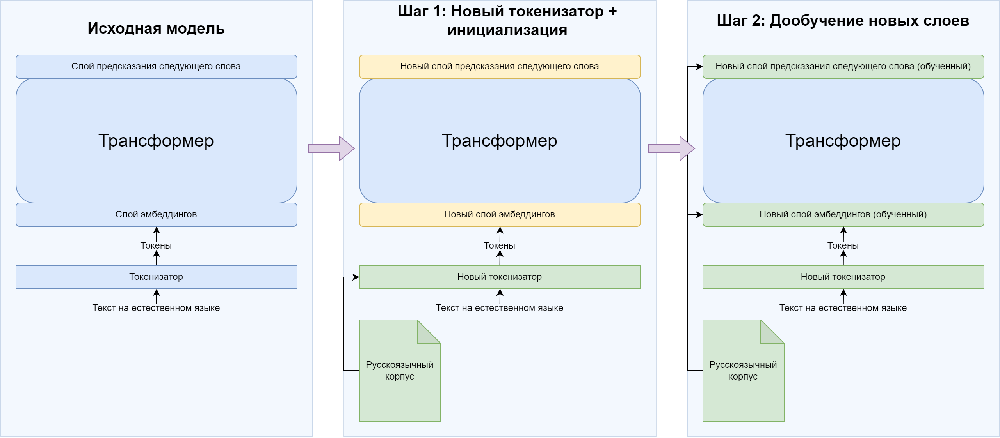

# RuAdapt
Репозиторий, куда будут выкладываться большие языковые модели, адаптированные на русский язык.

# Models
## LLaMa-2
1) Адаптированная LLaMa-2 7B
https://huggingface.co/rccmsu/ruadapt_llama2_7b_v0.1

2) Инструктивная адаптированная LLaMa-2 7B на датасетах Saiga
https://huggingface.co/rccmsu/ruadapt_saiga2_7b_v0.1

## Mistral
1) Частично адаптированная Mistral 7B (возникли проблемы после 0.8 эпохи).
https://huggingface.co/rccmsu/ruadapt_mistral_7b_v0.1

2) Инструктивная адаптированная Mistral 7B на датасетах Saiga
https://huggingface.co/rccmsu/ruadapt_mistral_saiga_7b_v0.1

# Paper 
Препринт: https://arxiv.org/pdf/2312.02598.pdf

Tikhomirov, M. M., Chernyshev D. I. Impact of Tokenization on LLaMa Russian Adaptation, Proceedings of Ivannikov ISPRAS Open Conference (2023)

# Pretraining dataset
darulm состоит из 43 GB, основан на https://huggingface.co/datasets/IlyaGusev/rulm с дополнительными шагами чистки и предобработки.
